# ESP32 battery/solar powerd environmental sensor

Battery/solar-powered ESP32 TTN (LoraWAN) sensor node for measuring temperature, humidity, air pressure and fine dust.

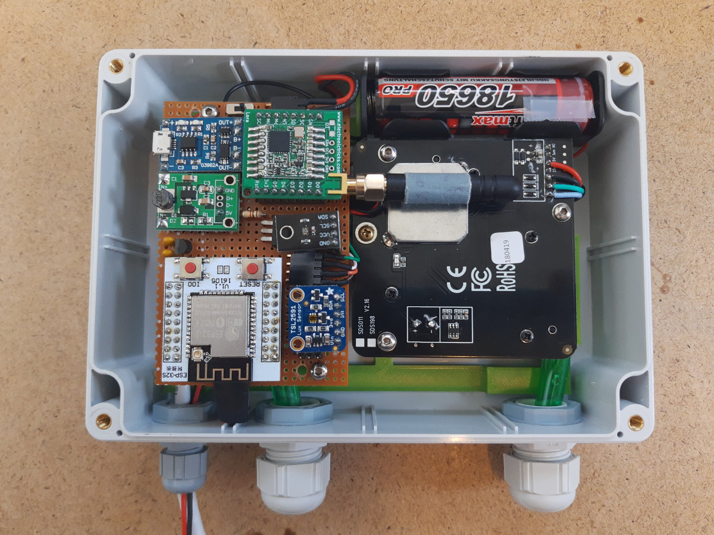

## Components / BOM

* 1x WROOM32 module
* 1x TP4056 module
* 1x MCP1700-3302E
* 1x Solar panel 6V 3W (180x150 mm)
* 1x 18650 battery
* 1x 18650 battery holder
* 1x 5V DC-DC boost converter module
* 1x RFM95 module
* 1x RFM95 breadboard
* 1x BME280 sensor
* 1x SDS011 module
* 1x TSL2591 sensor
* 1x IRL3103PBF
* 1x VEML6075 sensor
* 1x Housing IP65 171 x 121 x 55 mm
* 1x Cable Gland PG7
* 2x Cable Gland PG11
* 7x Standoff/Spacer 20 mm
* ...

## Schematic

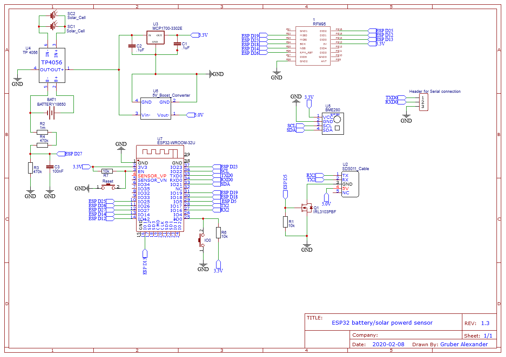

### TP4056 modification

The charging LED lights up as soon as the solarpannel supplies some current. However, this will cause the LED to discharge the battery when there is little sunshine.

To prevent this, I have soldered out the charging LED.

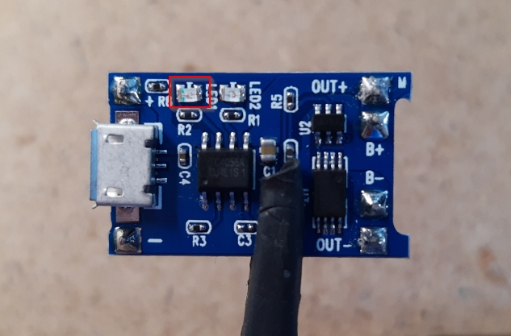

### Solar panel

The simple solar panels with plastic covers do not withstand UV radiation and wether conditions very well outdoors and the performance decreases drastically.

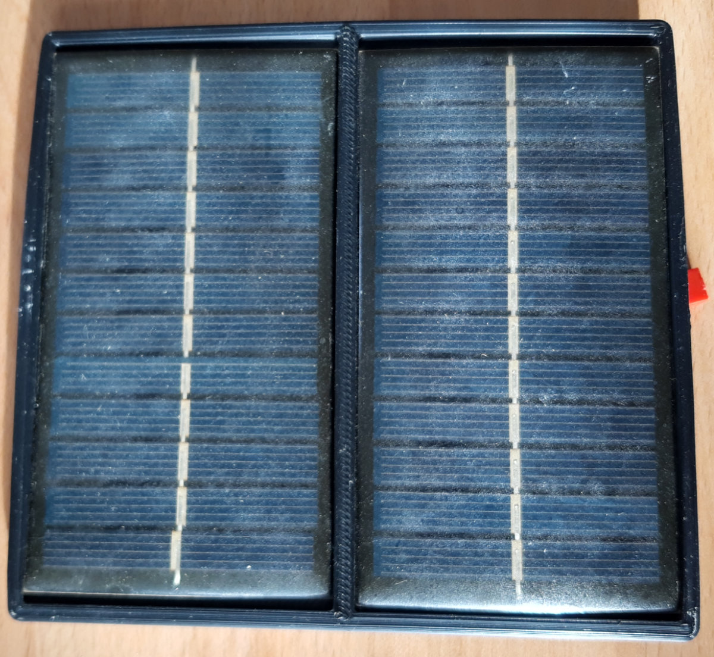

Therefore, I now use a slightly better one with a glass cover.

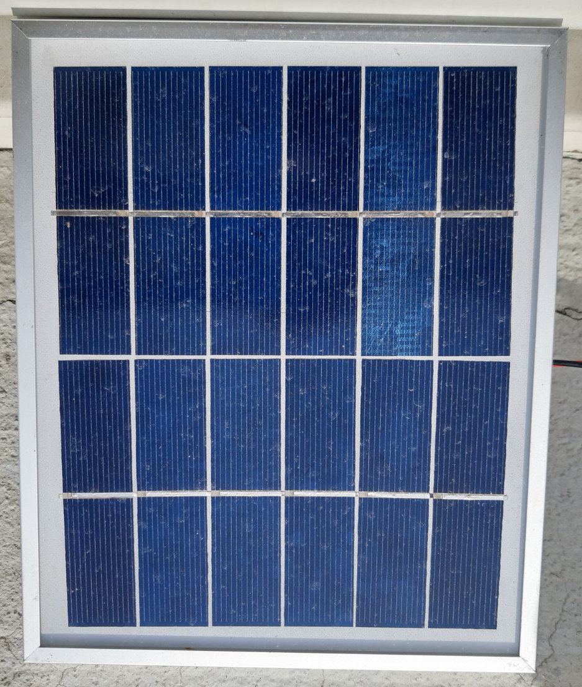

### RFM95 Breadboard

I have use the [iBrick / RFM95LORA Breadboard](https://github.com/iBrick/RFM95LORA_Breadboard) to make the RFM95 module breadboard/hole matrix board friendly. You can direct download the [Gerberfile](https://github.com/iBrick/RFM95LORA_Breadboard/blob/master/RFM95Breadboard.rar) from the Git repro.

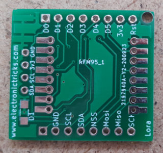

## Power consumption

| Mode | Power consumption |
| ---- | ----------------- |
| SDS011 measurement (30 sec) | 175 mA |
| LoRa activity | 7 mA |
| DeepSleep | 52 uA |

### Battery levels overview (Measuring and data send interval every 5 minutes)

The data are still from the use with the 2W solar pannel!

#### No charge current  

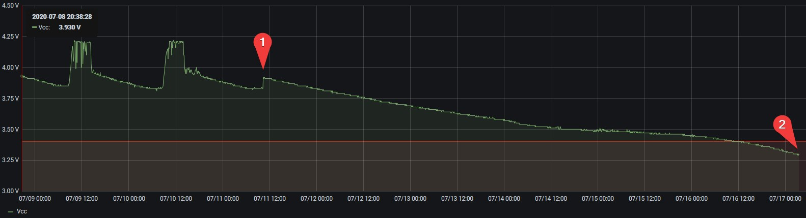

`1` = Disconnect solar pannel, `2` = Last data packet sent

#### Normal operation

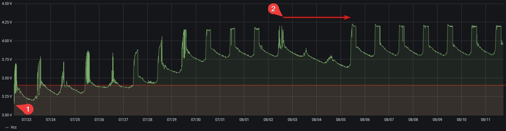

`1` = First data packet sent after after approx. 6 houre of charge, `2` = Rainy days

## TTN payload decoder

```javascript
function Decoder(bytes, port) {
  var decoded = {};
  
  decoded.vcc = (bytes[0] + 200)/100;

  if(bytes[1] != 255 || bytes[2] != 255)
  {
    decoded.pm25 = ((bytes[1] << (8*1) | bytes[2] << (8*0)) / 10);
  }

  if(bytes[3] != 255 || bytes[4] != 255)
  {
    decoded.pm10 = ((bytes[3] << (8*1) | bytes[4] << (8*0)) / 10);
  }
  
  if(bytes[5] != 255 || bytes[6] != 255)
  {
    decoded.temperature = ((bytes[5]<<24>>16 | bytes[6]) / 10);
  }
  
  if(bytes[7] != 255)
  {
    decoded.humidity = bytes[7];
    decoded.humidity &= ~(1 << 7);
    if(bytes[7] >> 7 == 1) { decoded.humidity +=0.5 }
  }
  
  pressure = (bytes[8] << (8*0) | bytes[9] << (8*1) | bytes[10]  << (8*2)) / 100;
  if(pressure >= 300 && pressure <= 1100) { decoded.pressure = pressure }

  if(bytes[11] != 255) decoded.uvi = bytes[11] / 10;

  if(bytes[14] != 255)
  {
    decoded.lux = (bytes[12] << (8*0) | bytes[13] << (8*1) | bytes[14]  << (8*2)) / 100;
  }
  
  return decoded;
}
```

## 3D Printing

### Sensor mounting

The STL and Fusion 360 Archive files are included in the 3D folder

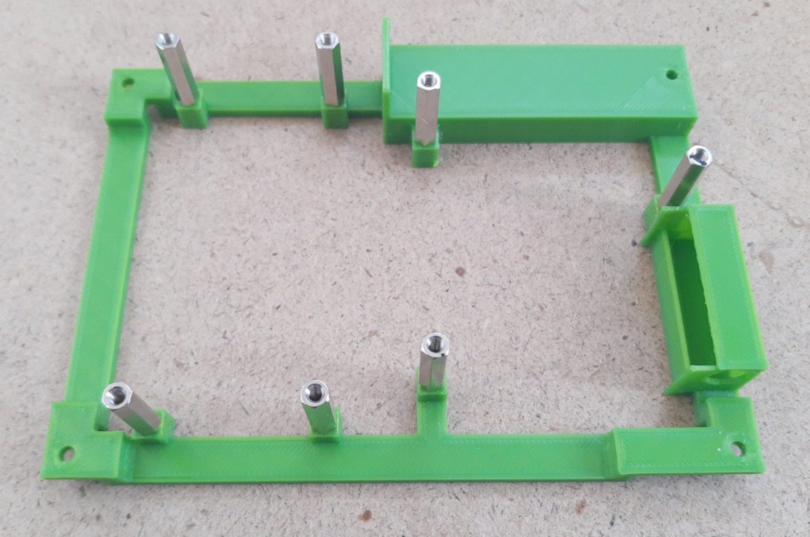

### Stevenson Screen

For the Stevenson Screen, I have used a modle from [Thingiverse](https://www.thingiverse.com/thing:3044446/files)

## Pictures

Grafana Dashboard for the visualization of the measured values.

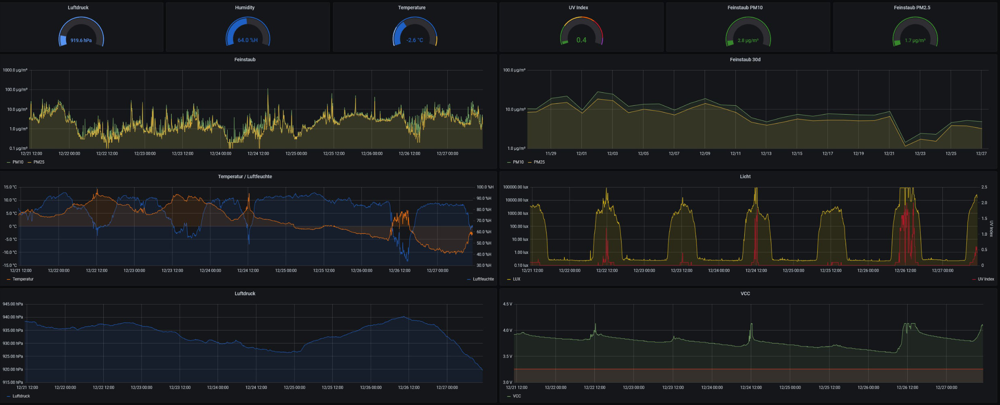

The whole mounted outside on the windowsill.

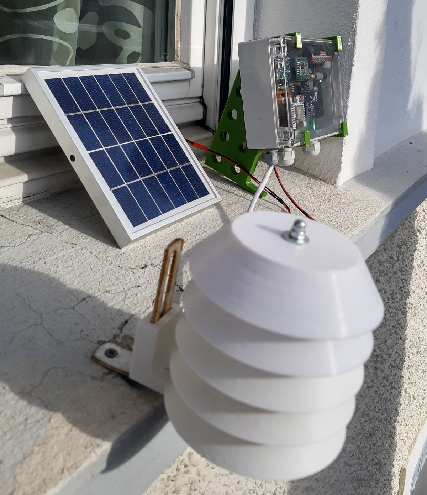


## Links

* [Thingiverse Stevenson Screen](https://www.thingiverse.com/thing:3044446/files)
* [iBrick / RFM95LORA Breadboard](https://github.com/iBrick/RFM95LORA_Breadboard)
