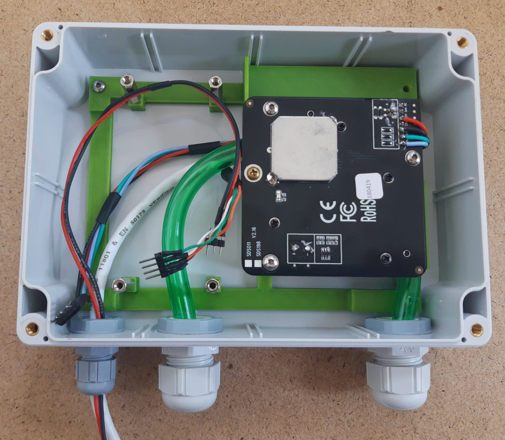

# ESP32 battery/solar powerd environmental sensor

Battery/solar-powered ESP32 TTN (LoraWAN) sensor node for measuring temperature, humidity, air pressure, fine dust, UV and LUX.


The microcontroller is an ESP32, but I don't use a ready-made module, because they need too much power even in DeepSleep. Instead I use a WROOM32 module.

The following sensors are used: SDS011 (Fine dust),  BME280 (Temperature / Humidity / Air pressure), VEML6075 (UV Index) and TSL2591 (LUX).

For power supply a 18650 battery is used, which is charged via solar pannel and TP4056. Since the ESP32 and the sensors require 3.3 V, the MCP1700-3302E voltage regulator is used, because the a full loaded 18650 provieds 4.2V and the ESP32 is only rated for 3.0 V~3.6 V. Only the SD011 needs 5V, these are generated with a step-up converter.

Since the SDS011 also needs too much current during the DeepSleep phases of the ESP32, it is switched on and off by N-channel MOSFET (IRL3103PBF).

Every 5 minutes the measurements are sent via LoRaWAN. I retrieve the values via MQTT and Telegraf and visualize them in a Grafana dashboard.

The whole thing was then installed in a weatherproof housing, the cables and the AAA are led down by Cable Glands to the outside to keep the housing as waterproof as possible. Only the BME280 was mounted outside in a Stevenson Screen.

## Components / BOM

* 1x WROOM32 module
* 1x TP4056 module
* 1x MCP1700-3302E
* 1x Solar panel 6V 3W (180x150 mm)
* 1x 18650 battery
* 1x 18650 battery holder
* 1x 5V DC-DC boost converter module
* 1x RFM95 module
* 1x RFM95 breadboard
* 1x BME280 sensor
* 1x SDS011 module
* 1x TSL2591 sensor
* 1x IRL3103PBF
* 1x VEML6075 sensor
* 1x Housing IP65 171 x 121 x 55 mm
* 1x Cable Gland PG7
* 2x Cable Gland PG11
* 7x Standoff/Spacer 20 mm
* Aquarium hose
* ...

## Schematic


### TP4056 modification

The charging LED lights up as soon as the solarpannel supplies some current. However, this will cause the LED to discharge the battery when there is little sunshine.

To prevent this, I have soldered out the charging LED.


### Solar panel

The simple solar panels with plastic covers do not withstand UV radiation and wether conditions very well outdoors and the performance decreases drastically.


Therefore, I now use a slightly better one with a glass cover.


### RFM95 Breadboard

I have use the [iBrick / RFM95LORA Breadboard](https://github.com/iBrick/RFM95LORA_Breadboard) to make the RFM95 module breadboard/hole matrix board friendly. You can direct download the [Gerberfile](https://github.com/iBrick/RFM95LORA_Breadboard/blob/master/RFM95Breadboard.rar) from the Git repro.


## Power consumption

| Mode | Power consumption |
| ---- | ----------------- |
| SDS011 measurement (30 sec) | 175 mA |
| LoRa activity | 7 mA |
| DeepSleep | 52 uA |

### Battery levels overview (Measuring and data send interval every 5 minutes)

The data are still from the use with the 2W solar pannel!

#### No charge current  


`1` = Disconnect solar pannel, `2` = Last data packet sent

#### Normal operation


`1` = First data packet sent after after approx. 6 houre of charge, `2` = Rainy days

## TTN payload decoder

```javascript
function Decoder(bytes, port) {
  var decoded = {};
  
  decoded.vcc = (bytes[0] + 200)/100;

  if(bytes[1] != 255 || bytes[2] != 255)
  {
    decoded.pm25 = ((bytes[1] << (8*1) | bytes[2] << (8*0)) / 10);
  }

  if(bytes[3] != 255 || bytes[4] != 255)
  {
    decoded.pm10 = ((bytes[3] << (8*1) | bytes[4] << (8*0)) / 10);
  }
  
  if(bytes[5] != 255 || bytes[6] != 255)
  {
    decoded.temperature = ((bytes[5]<<24>>16 | bytes[6]) / 10);
  }
  
  if(bytes[7] != 255)
  {
    decoded.humidity = bytes[7];
    decoded.humidity &= ~(1 << 7);
    if(bytes[7] >> 7 == 1) { decoded.humidity +=0.5 }
  }
  
  pressure = (bytes[8] << (8*0) | bytes[9] << (8*1) | bytes[10]  << (8*2)) / 100;
  if(pressure >= 300 && pressure <= 1100) { decoded.pressure = pressure }

  if(bytes[11] != 255) decoded.uvi = bytes[11] / 10;

  if(bytes[14] != 255)
  {
    decoded.lux = (bytes[12] << (8*0) | bytes[13] << (8*1) | bytes[14]  << (8*2)) / 100;
  }
  
  return decoded;
}
```

## 3D Printing

### PCB and SDS011 mounting

The STL and Fusion 360 Archive files are included in the 3D folder




### Stevenson Screen

For the Stevenson Screen, I have used a modle from [Thingiverse](https://www.thingiverse.com/thing:3044446/files)

## Pictures

Grafana Dashboard for the visualization of the measured values.


The whole mounted outside on the windowsill.


## Links

* [Thingiverse Stevenson Screen](https://www.thingiverse.com/thing:3044446/files)
* [iBrick / RFM95LORA Breadboard](https://github.com/iBrick/RFM95LORA_Breadboard)
